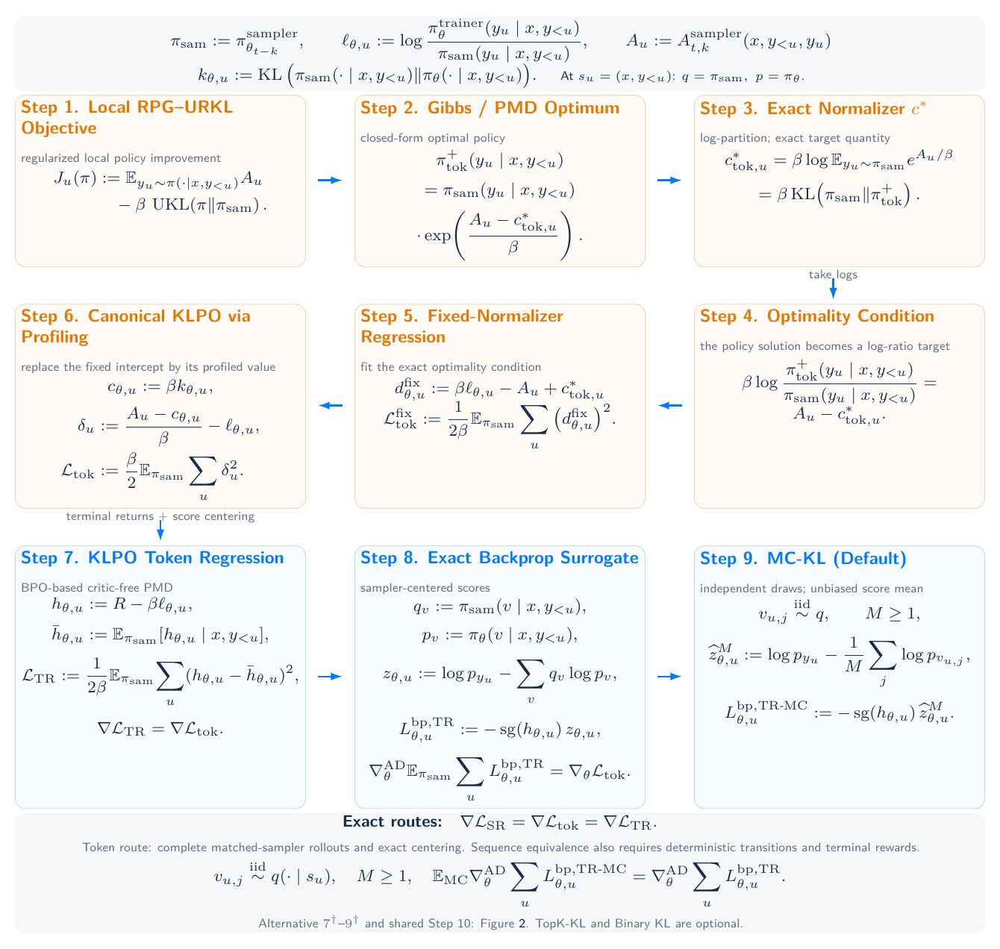

# KLPO

**KL-Regularized Policy Optimization for Critic-Free Agentic Reinforcement Learning**

KLPO is a critic-free, single-rollout method for off-policy agentic reinforcement learning. This repository implements **KLPO token regression + Monte Carlo KL (MC-KL)** by default: terminal rewards provide the feedback, and independent auxiliary token draws estimate the sampler-conditioned score correction. It needs no same-prompt response group or learned value/normalizer model.

[](https://yifanzhang-pro.github.io/KLPO/)
[](KLPO.pdf)
[](https://github.com/yifanzhang-pro/KLPO/actions/workflows/tests.yml)
[](LICENSE)

**Authors:** [Yifan Zhang](https://yifzhang.com) et al.<br>
**Technical report:** September 18, 2026 · **Revised:** September 20, 2026

[[Project website](https://yifanzhang-pro.github.io/KLPO/)] [[Paper](KLPO.pdf)] [[Algorithm reference](docs/algorithms.md)] [[Training guide](docs/training.md)] [[Paper source](https://github.com/yifanzhang-pro/RPG-2-Overleaf)]

## Overview

- **One complete response per prompt is sufficient.** MC-KL uses auxiliary *token* draws at visited prefixes, not extra response rollouts.
- **Token regression + MC-KL is the default.** Each token uses its own coefficient `R - beta * log(p_action / q_action)` and an independently estimated score correction.
- **Two regression routes, four KL estimators.** Sequence regression is an alternative; TopK-KL, Binary KL, and Full KL are selectable for either route.
- **Single-turn and multi-turn Molt integration.** Experiment recipes cover R1/Qwen-Math, Python tools, and ALFWorld. The [labs-molt KLPO branch](https://github.com/yifanzhang-pro/labs-molt/tree/feat/klpo-all-kl) preserves sampler records across assistant turns and tool observations; the pinned backend uses synchronous collection.

[](KLPO.pdf#page=2)

*Figure 1 from the report. Step 7 builds on [BPO’s critic-free PMD reformulation](https://arxiv.org/html/2609.15987v1#S3.SS1); Step 8 uses [Score Centering](https://arxiv.org/abs/2609.20807v1). Independent MC-KL recovers the full-KL gradient in expectation under the stated sampling assumptions. TopK-KL and Binary KL are optional approximations.*

## Quick start

Requires Python 3.10+ and PyTorch 2.2+. The toy example runs on CPU without a model or dataset download.

```bash
git clone https://github.com/yifanzhang-pro/KLPO.git
cd KLPO
python -m venv .venv
source .venv/bin/activate
pip install -e '.[test]'

python examples/train_toy.py  # Default: token regression + MC-KL, M=128
python examples/train_toy.py --mc-samples 1
python -m pytest -q
```

The example uses variable-length responses, a terminal verifier, historical sampler versions, and repeated learner updates. **M counts independent auxiliary tokens per prefix**; token regression supports M ≥ 1. The example is an implementation check, not a benchmark reproduction.

## The default update

Let `q` be the actual collection sampler, `p` the current trainer, and `R` the terminal reward. At each visited prefix, draw `v_j ~ q` IID with replacement, independently of the complete rollout. The backward surrogate is:

```text
ell_u = log p(a_u) - log q(a_u)
z_u   = log p(a_u) - mean_j log p(v_j)
loss  = -mean_responses sum_tokens stopgrad(R - beta * ell_u) * z_u
```

Sum over generated policy tokens and average over complete responses, without length normalization. Keep the recorded sampler probabilities and version fixed during reuse. See the [loss API and sampling contracts](docs/algorithms.md#default-klpo-token-regression--mc-kl) for differentiable trainer inputs, masks, and adaptive replay requirements.

## Regression routes and KL estimators

The regression route selects the feedback coefficient; the KL estimator selects the conditional score correction. All eight combinations are implemented. **M is the number of random draws; K is the TopK-KL head size.**

| Regression route | KL estimator | Toy example options |
| --- | --- | --- |
| **Token (default)** | **MC-KL (default)** | No flags; `--mc-samples 128` by default, M ≥ 1 |
| Token | TopK-KL | `--kl-estimator topk --top-k 2` |
| Token | Binary KL | `--kl-estimator binary` |
| Token | Full KL | `--kl-estimator full` |
| Sequence | MC-KL | `--route sequence --mc-samples 8` (M ≥ 2) |
| Sequence | TopK-KL | `--route sequence --kl-estimator topk --top-k 2` |
| Sequence | Binary KL | `--route sequence --kl-estimator binary` |
| Sequence | Full KL | `--route sequence --kl-estimator full` |

MC-KL averages independent sampler log-ratios. **Top-K Aggregated KL (TopK-KL)** keeps the sampler's K largest probabilities and combines all remaining tokens into one tail bucket. Binary KL groups the sampled action against its complement; Full KL uses the entire vocabulary. The toy vocabulary has four tokens, so `--top-k 2` illustrates a nontrivial head/tail split; the training launcher defaults to K=128 when TopK-KL is selected.

Token regression uses per-token feedback; sequence regression uses trajectory feedback. Sequence MC-KL requires M ≥ 2 for leave-one-out residuals. Full-KL and independent-MC population equivalences require the report's assumptions; individual sample gradients can differ, and finite TopK-KL/Binary approximations need not preserve those equivalences. KLPO sequence regression is distinct from the SKLPO response-Gibbs comparison in the paper's appendix.

## Training and documentation

| Resource | Contents |
| --- | --- |
| [Algorithm reference](docs/algorithms.md) | Loss APIs, all eight combinations, numerical stabilization, sampling and replay contracts |
| [Training guide](docs/training.md) | Pinned native Molt installation, R1/Qwen-Math launchers, tensor contracts, supported execution |
| [Experiment settings](examples/README.md) | Single-turn R1/Qwen-Math; Python tools (10/20 turns); ALFWorld (50 turns); all eight loss combinations |
| [CPU example](examples/train_toy.py) | Small autoregressive policy with a terminal verifier and historical samplers |
| [Paper](KLPO.pdf) · [LaTeX source](https://github.com/yifanzhang-pro/RPG-2-Overleaf) | Derivations, proofs, assumptions, and SKLPO comparison |
| [Website maintenance](docs/website.md) | Local preview, GitHub Pages publication, and updating the paper snapshot |

All recipes default to `--route token --kl-estimator mc --mc-samples 128`. The pinned backend requires synchronous collection with complete trajectories and one update per batch. The unified `examples/run_experiment.py` launcher sets this automatically for single-turn and multi-turn settings; pass `--sync` to the retained `scripts/train_molt.py` launcher (its asynchronous switches are not supported by the current pin). GPU training requires a compatible Linux/CUDA environment; follow the training guide. The optional predicted-KL budget is disabled in these launchers.

Preview single-turn and multi-turn experiments without installing Molt:

```bash
python examples/run_experiment.py \
  --setting deepseek_r1_distill_qwen_1p5b_math_sanity --print-config
python examples/run_experiment.py \
  --setting qwen2p5_7b_instruct_python_tool_10turn --print-config
```

The [experiment guide](examples/README.md) provides all five launch settings, agent/data requirements, and evaluation protocols. Single-turn settings use Molt's built-in math agent; multi-turn agents, datasets, and checkpoints are supplied separately.

## Validation and scope

CPU tests cover all eight combinations, independent MC gradient expectations, leave-one-out residuals, M=1 token updates, TopK-KL tail corrections, masked/extreme probabilities, and trajectory/microbatch normalization. To also check the native backend contract:

```bash
MOLT_SOURCE_PATH=/path/to/labs-molt python -m pytest -q
```

This release provides the theory, loss implementation, CPU verification, and native training integration. **GPU training and paper-scale benchmark reproduction have not been validated.** Example hyperparameters are starting values, not tuned benchmark settings. Multi-turn tests cover native command validation, worker environment propagation, and complete-trajectory masking. The supported synchronous recipes consume each auxiliary record bank once; fixed-record reuse remains an empirical surrogate rather than a fresh conditionally unbiased MC estimate.

## Citation

```bibtex
@techreport{zhang2026klpo,
  title  = {{KL}-Regularized Policy Optimization for Critic-Free Agentic Reinforcement Learning},
  author = {Zhang, Yifan and others},
  year   = {2026},
  month  = sep,
  url    = {https://yifanzhang-pro.github.io/KLPO/}
}
```

[Download BibTeX](citation.bib). The [published PDF](KLPO.pdf) is a snapshot of paper-source commit [`1658d8d`](https://github.com/yifanzhang-pro/RPG-2-Overleaf/commit/1658d8d).

## License and acknowledgments

Code is licensed under [Apache 2.0](LICENSE). Training launcher scaffolding is adapted from [FlashREINFORCE](https://github.com/yifanzhang-pro/FlashREINFORCE). The separately installed [labs-molt backend](https://github.com/yifanzhang-pro/labs-molt/tree/feat/klpo-all-kl) retains its own licenses and notices; see [NOTICE](NOTICE).
